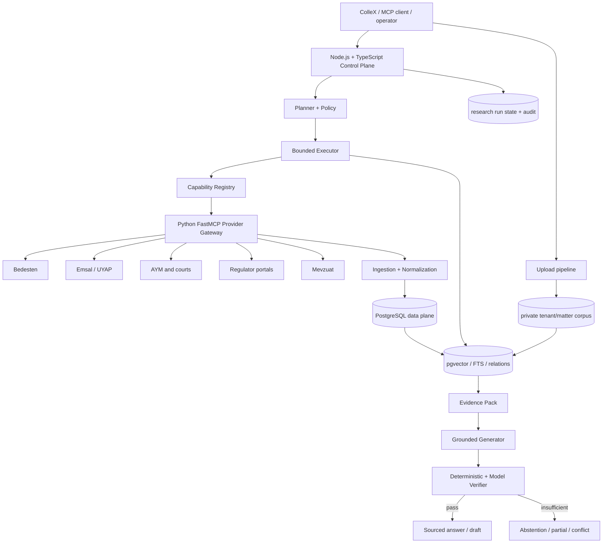
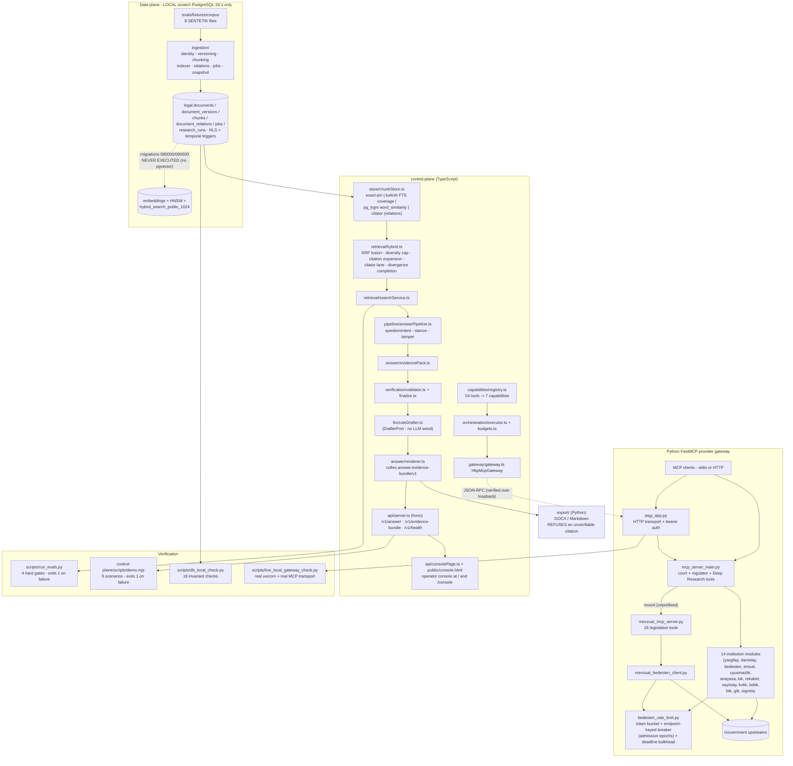

# Architecture overview

Status: living document. Last updated: **2026-09-03**, **after W14 phase C**.
The diagrams in §2 still draw the 2026-08-27 core; **§7 lists what W12 added
on top of it** and **§8 what W14, its phase-F fix lanes and the phase-C
cleanup added**. Numbers are never written here — they live in `STATUS.md`
"Ölçülen sayılar" (S1–S40) and are cited by row.

**Phase C changed no architecture.** It closed defects inside the shapes §8
already describes: the backup archive's file name became a derived value
instead of a constant, every `.strict()` route was routed through one issue
helper, the contrary-authority lanes gained a provably narrow skip condition
(and an additive `skipped` flag to say which of two things happened), and the
console gained folding and a matching-sentence line. Two additive response
fields and nothing else on the wire.

This file describes (1) the target architecture from the master build brief,
(2) what actually exists in this repository today, (3) the data-flow chains
that now run end to end, and (4) the tool dependency chains for the provider
families.

> **Two facts that constrain every diagram below.**
> **pgvector cannot be installed on this machine**, so the dense retrieval lane
> is a `NoopDenseLane` and migrations `20260826080000`/`20260826090000` are
> pglast-syntax-validated only and never executed. And the corpus every
> measured number comes from is **SENTETİK** authored test data, not real
> Turkish law.

## 1. Target architecture (brief §6.2 layers)



Design principles (brief §6.1, abbreviated): the provider layer is not the
truth layer; search results are not evidence; a citation is not a
verification; agents are bounded; public and private corpora live in separate
security lanes; every model/version is an explicit profile; a provider error
is never an empty result (`ok / empty / partial / unavailable / invalid /
forbidden`); the 54/55 external tools stay backward compatible while
collapsing internally onto a small capability registry; eval before scale.

## 2. Current state (this repository, 2026-08-27)

Solid arrows are paths that run today and are covered by a command with a
recorded exit code. Dashed arrows are declared-but-unexecuted.



Key current-state facts:

- **Tool surface: exactly 54 offline, 55 with an embedding key** (the
  conditional `search_bedesten_semantic`). Asserted three ways:
  `scripts/smoke_check.py` (in-process), `scripts/http_e2e_check.py` (HTTP),
  and `scripts/live_local_gateway_check.py` (a real uvicorn worker over the
  real MCP streamable-HTTP transport, plus a 401 probe).
- **The control-plane now reads a real corpus.** `chunkStore.ts` issues real
  SQL against `legal.chunks`; the answer pipeline, evidence pack, validator
  and renderer run on top of it, and the HTTP API and operator console sit on
  top of that.
- **Rate limiting** is still a process-wide singleton token bucket shared by
  court Bedesten, legislation Bedesten and the health check, now wrapped in an
  endpoint-keyed circuit breaker with admission epochs and a deadline-bounded
  bulkhead. It is per-process: **a single worker is mandatory**.
- **The dense lane is inert here.** Everything measured is exact-pin +
  `turkish` FTS + `pg_trgm` + the citator (relation) lane.
- **No hardcoded credential fallbacks remain**; missing
  `BRAVE_API_TOKEN` / `TAVILY_API_KEY` / `OPENROUTER_API_KEY` fail closed with
  an explicit disabled/missing-credential result.
- The old in-memory NumPy semantic lanes (`semantic_search/`,
  `mevzuat_semantic_search/`) still back the key-gated 55th tool and the
  `search_within_*` tools. They are per-call, per-document caches — **not**
  the persistent corpus, which is the data plane above.

## 3. Data-flow chains that run today

### 3.1 Ingestion (fixture corpus → PostgreSQL, with provenance)

```text
evals/fixtures/corpus/*.json  (SENTETIK)
  -> ingestion/cli.py                    (--recreate-db, --apply-migrations, --include)
  -> ingestion/migrations.py             applies the non-pgvector migrations by the
                                         pgvector marker in each file's header
  -> ingestion/snapshot.py               raw snapshot + raw_sha256 (dedupe unique)
  -> ingestion/identity.py               (source, external_id) public /
                                         (tenant_id, source, external_id) tenant
  -> ingestion/versioning.py             append version; the DATABASE closes the
                                         previous one (BEFORE INSERT trigger,
                                         ADR-012) and rejects overlapping in-force
                                         spans (EXCLUDE)
  -> ingestion/chunking.py               NFC canonical text, code-point offsets,
                                         NON-OVERLAPPING spans (EXCLUDE, ADR-013),
                                         normalizer_version
  -> ingestion/indexer.py                search_tsv (simple) + search_tsv_tr (turkish)
                                         generated columns + pg_trgm index
  -> ingestion/relations.py              amendment EDGES into legal.document_relations,
                                         each target resolved through
                                         legal_reference/resolver.py; the hint is a
                                         CLAIM, the resolution is recorded as
                                         resolved | ambiguous | manual with
                                         confidence + resolver_version + the verbatim
                                         hint. An unresolvable hint is reported, never
                                         silently dropped                    [ADR-015]
  -> ingestion/jobs.py                   idempotent queue, claim_jobs() SKIP LOCKED
  -> legal.* tables under RLS            (ADR-011)
tests: tests/ingestion/*  |  invariants: scripts/db_local_check.py (17 checks)
```

### 3.2 Retrieval (question → ranked passages)

```text
question (+ optional as_of)
  -> searchLegalCorpus            control-plane/src/retrieval/searchService.ts
  -> searchPipeline               control-plane/src/retrieval/hybrid.ts
       normalizeTurkishSearch     (dotted/dotless I handled correctly)
       parseReferences            abbreviations (TCK -> 5237) + article forms
       (a) exact-pin lane         as-of-filtered version pin
       (b) lexical lane           'turkish' FTS, COVERAGE mode: OR the lexemes of
                                  to_tsvector(config, query), keep chunks covering
                                  >= minCoverage (default 0.25) of them  [ADR-007]
       (c) trigram lane           pg_trgm word_similarity (NOT symmetric similarity)
       (d) dense lane             NoopDenseLane  <-- INERT: no pgvector here
       -> RRF fusion + per-document diversity cap
       -> citation expansion      one hop, outbound only, resolved at the question's
                                  as_of date; self-citations dropped        [ADR-009]
       (e) citator lane           follows legal.document_relations edges BOTH ways
                                  (which instruments amend this provision / which
                                  provisions does this passage amend). Only
                                  'resolved' edges; seeded only from already-ranked
                                  passages, so abstention is unchanged      [ADR-015]
       -> divergence completion   second lower-floor lexical pass admitting judicial
                                  passages whose outcome DIFFERS; symmetric; skipped
                                  for NORM_CONTENT questions                [ADR-008]
       every lane failure is contained and reported, never raised
  -> ranked hits, each with lane provenance and a stable tie-break
     (source, external_id, ordinal, id)                                     [ADR-010]
tests: control-plane/tests/{store/retrieval,quality/retrievalQuality,rrf,normalize}.test.ts
measured: scripts/run_evals.py -> evals/reports/fixture_baseline_<date>.{json,md}
```

### 3.3 Answer + verification + export

```text
ranked hits
  -> buildEvidencePack        control-plane/src/answer/evidencePack.ts
       fetch canonical text, slice by CODE-POINT offsets, recompute sha256
  -> validateEvidence         control-plane/src/verification/validator.ts
       OFFSET_OUT_OF_RANGE | QUOTE_OFFSET_MISMATCH | QUOTE_HASH_MISMATCH |
       DOCUMENT_VERSION_MISMATCH
  -> classifyStance           control-plane/src/pipeline/stance.ts
       marker table; legislation is never contrary authority
  -> RuleBasedDrafter         control-plane/src/llm/ruleDrafter.ts (DrafterPort)
  -> verifyAnswer + canFinalize   control-plane/src/answer/verifier.ts,
                                  control-plane/src/verification/finalize.ts
       COMPLETE | QUALIFIED | PARTIAL | ABSTAIN (+ CONFLICTING_AUTHORITIES)
  -> renderAnswer             control-plane/src/answer/renderer.ts
       -> collex.answer.evidence-bundle/v1                                  [ADR-014]
  -> HTTP                     control-plane/src/api/server.ts
       POST /v1/answer · POST /v1/evidence-bundle ·
       GET /v1/answers/{runId}/evidence-bundle · GET /v1/health
  -> operator console         / and /console; textContent only, CSP pins the page's
                              own inline script/style hashes, no remote assets
  -> export/ (Python)         export/bundle.py parses the SAME contract strictly;
                              export/verify.py re-derives every quote from the
                              canonical text by its own offsets BEFORE writing;
                              one failure => nothing written, exit 2
tests: control-plane/tests/{answer/*,pipeline/*,validator,finalize}.test.ts,
       tests/export/*  |  end to end: control-plane/scripts/demo.mjs (6 scenarios)
```

### 3.4 The eval gate (what CI actually enforces)

```text
scripts/run_evals.py
  -> recreate collex_eval_test (that name only)
  -> ingestion CLI over evals/fixtures/corpus
  -> evals/retrieval/measure_retrieval.ts   calls the PRODUCT's own functions
                                            (searchLegalCorpus, buildEvidencePack),
                                            not the HTTP /v1/search scaffold
  -> join database UUIDs back to stable unit ids AFTER ranking (never reorders)
  -> evals/retrieval/gates.py               four hard gates, brief 13.1:
        citation_resolvability == 100%
        quote_hash_integrity   == 100%
        fabricated_ids         == 0
        cross_tenant_leak_indicators == 0
     + no total lane failure, no dropped gold query
  -> exit 1 if any gate fails; dated report into evals/reports/
CI: ci.yml job `eval-gate` (postgres:16 service container, loopback only);
    the DB-free subset runs in `python-offline` via --fixture-only
```

## 4. Tool dependency chains (provider families)

Canonical chain shape:

```text
tool -> helper -> client -> upstream -> limiter -> error contract -> test
```

### 4.1 Bedesten court family

```text
search_bedesten_unified / get_bedesten_document_markdown
  -> bedesten_mcp_module/client.py (BedestenApiClient)
  -> bedesten.adalet.gov.tr (searchDocuments / getDocumentContent)
  -> shared bedesten_rate_limiter: token bucket (owns the single 429 retry)
     + endpoint-keyed breaker with admission epochs + deadline-bounded bulkhead
  -> typed failure contract: RATE_LIMITED / UNAVAILABLE / TIMEOUT / PARSER_ERROR;
     null-safe parsing of emsalKararList / content / mimeType;
     content_sha256 + retrieved_at on canonical fetch
  -> tests: tests/resilience/*, tests/test_facade_contracts.py,
     scripts/smoke_check.py; live: scripts/live_regression_check.py (manual)
```

The Deep Research `fetch` tool reaches the same `get_document_as_markdown`
backend as `get_bedesten_document_markdown`. Parity is proven on a fixture
(`tests/resilience/test_fetch_parity.py`: identical normalized text, equal
hash). They must never be used as network fallbacks for each other in one
request.

### 4.2 Bedesten legislation family (`search_mevzuat` + nine tools)

```text
search_mevzuat, search_kanun, search_teblig, search_cbk, search_cbyonetmelik,
search_cbbaskankarar, search_cbgenelge, search_khk, search_tuzuk,
search_kurum_yonetmelik
  -> mevzuat_mcp_server.py tool wrappers
  -> _search_documents_resilient (ONE shared helper — the common-mode surface)
  -> mevzuat_bedesten_client.py
  -> bedesten.adalet.gov.tr (legislation endpoints)
  -> the SAME shared bedesten_rate_limiter as the court family
  -> error contract: a typed failure, NEVER an empty list; parseable
     "RATE_LIMITED retry_after=N.N: ..." / "UNAVAILABLE retry_after=N.N: ..."
     prefixes; page_size validated 1..20 (legacy path clamps with min(...,20))
  -> tests: tests/test_page_size_regression.py, tests/test_facade_contracts.py,
     tests/resilience/test_error_contract.py
```

Nine aliases share one helper, one client and one limiter, so a Bedesten
outage takes all nine down together. The breaker keys on the **upstream
endpoint**, not the tool name, so that outage produces one breaker state, not
nine.

### 4.3 Emsal family

```text
search_emsal_detailed_decisions / get_emsal_document_markdown
  -> emsal_mcp_module/client.py -> emsal.uyap.gov.tr
  -> dedicated Emsal token bucket (EMSAL_RATE_CAPACITY/REFILL_S/MAX_WAIT_S)
  -> typed error contract
  -> tests: offline smoke (models + fake client), live scripts
Semantic lane: emsal_semantic.rerank_emsal_decisions fetches up to 10 keyword
candidates and reranks them with the embedder (fake embedder in the smoke test).
```

### 4.4 KVKK / BDDK / Sigorta via Brave and Tavily

```text
search_kvkk_decisions -> kvkk_mcp_module/client.py
  -> api.search.brave.com (BRAVE_API_TOKEN; FAIL-CLOSED when empty)
  -> site-scoped query (site:kvkk.gov.tr) -> kvkk.gov.tr document fetch
  -> get_kvkk_document_markdown: MarkItDown + BytesIO, 5,000-char pagination

search_bddk_decisions / search_sigorta_tahkim_decisions
  -> bddk_mcp_module/client.py, sigorta_tahkim_mcp_module/client.py
  -> Tavily API (TAVILY_API_KEY; FAIL-CLOSED when empty)
  -> institution site document fetch -> paginated markdown

error contract: an empty key produces an explicit "disabled / missing
credential" result and makes NO call — never an embedded fallback token
(see the 2026-08-26 incident record)
tests: tests/test_disabled_modules.py, scripts/smoke_check.py; live scripts
cover the credentialed paths
```

### 4.5 In-memory semantic lanes (not the corpus)

```text
search_bedesten_semantic   (registered only when OPENROUTER_API_KEY is set; 55th tool)
  -> keyword search for up to 10 candidates -> sequential document fetch
  -> semantic_search/embedder.py (OpenRouter or LOCAL_EMBEDDING_* lane)
  -> a FRESH in-memory NumPy vector store per call
search_within_*  (mevzuat)
  -> mevzuat_semantic_search/: chunk + embed a single document on demand;
     1-hour process-memory cache (MD5 for invalidation only, never provenance)
tests: smoke uses a fake embedder + fake clients; scripts/embedding_quality_check.py
is a MANUAL 4-query sanity script — it is not a gold set and its 4/4 is not a score
```

These lanes are deliberately separate from the data plane: they hold no
provenance, no offsets and no hashes, and nothing citable is ever produced
from them.

### 4.6 Other regulator families

Anayasa (JSON API `/api/core/public/search`), Uyuşmazlık (WebForms scrape +
PDF), KİK v2 (three decision-type endpoints), Rekabet, Sayıştay (unified),
BTK (JSON API + PDF), GİB Özelge — each has its own module client and upstream
and is independent of the Bedesten limiter. Their containment requirement is
the inverse: a Bedesten outage must not degrade them.

## 5. Capability collapse (brief §6.5)

`control-plane/src/capabilities/registry.ts` maps the 54 offline tools onto
**7 stable capabilities**: `caseLaw.search`, `legislation.search`,
`regulator.search`, `document.fetch`, `document.searchWithin`,
`legislation.resolveTarget`, `source.health`. The planner only ever sees
capability names; raw tool names stay inside the gateway and adapters. The
registry is frozen and orphan-tested, and `EXPECTED_TOOL_COUNT = 54` ties it
to `scripts/smoke_check.py`. The conditional 55th tool is deliberately outside
the invariant.

## 6. Where the remaining seams are

1. **The dense lane** is declared (migrations `080000`/`090000`, embedding
   profiles, `hybrid_search_public_1024`) but has never run. This is the
   single largest gap between §1 and §2.
2. **Citator edge quality on real law is unmeasured.** The amendment edges the
   citator lane follows are extracted at ingest from an instrument's own
   `structure_hints.amendments`; on this corpus that structure is a synthetic
   torba kanun's, and it is tidy. Real Turkish instruments will not be, so
   edge coverage and resolver precision on real legislation are unknown
   (ADR-015).
3. **Answers, drafts, matters and settings are durable since W12**
   (ADR-016, `app_private.answers/drafts/matters/settings`); the
   `research_runs/steps/evidence/claims` tables of `20260826040000` are still
   unused, and the in-flight progress feed of an async live run is in-memory
   (16 runs, 30 min TTL). Single-user posture: RLS is bypassed locally.
4. **No LLM planner is wired.** The cloud lane (ADR-018) is a per-request,
   consent-gated drafter/entailment/analysis/OCR port, OFF by default and
   live-untested; the rule-based drafter is what runs.
5. **Upload / private corpus / matter memory** (brief phases 6–7) now run
   locally: intake with quarantine and a per-page scan gate, file-scoped
   answers (`filters.fileIds`), the matter workspace with auto-linking. Not
   there: object storage, a private vector lane (pgvector), retention
   policies, multi-tenant enforcement on the app path.
6. **Eight surfaces carry an explicit "unverified" label by design** and
   STATUS lists them one by one: the cloud AI lane (`liveTested:false`), the
   UDF export (`deneysel`, never opened in the UYAP editor), the 25 of 41
   deadline rules that are still `dogrulanmadi` (S10), the 17 of 20 fee lines
   with `amount: null` (S11), live case-law search (never run against a real
   upstream), the `.ics` stream (never opened in a calendar client), the
   local library (written, never ingested) and the citation audit (a coverage
   statement — its `NOT_FOUND` bucket is unreachable by design). The coverage
   gate (ADR-017) is lexical and its 0.4 floor is unmeasured on real law.
7. **Corpus search has a measured ceiling, and its worst case is the empty
   one.** At 20 000 chunks a common-word corpus question takes ≈3,8 s and
   ANSWERS — phase F made the trigram lane a budgeted fallback and cut it
   from 47–64 s. But the same measurement found that **a phrase that appears
   nowhere in the corpus is now the SLOWEST query: ≈7,5 s, and it returns
   nothing**, all three lanes cut by their own budget (S25‴). Narrowing the
   residual lexical cost needs either a candidate-narrowing index or the
   dense lane, i.e. seam 1; making the empty case bearable needs a progress
   line and a cancel button, which do not exist. A document-scoped question
   is 71–73 ms and is unaffected: what is slow is corpus search, not the
   daily path. A second, quieter ceiling sits beside it: **the trigram
   lane's plan behaviour differs from probe corpus to probe corpus** (three
   corpora, three tables, two lanes reaching opposite conclusions about the
   same query), so no speed-up figure in this document set may be quoted for
   `/v1/answer` (S26⁐).
8. **The console draws most, not all, of what the server can do.** Phase B2
   landed six new screens under the vaporware gate (every endpoint probed
   over real HTTP before it was drawn) and phase F fixed fifteen defects in
   them (S32), but twelve contracts still have an endpoint and no control —
   contacts, "Nerede kalmıştım", the matter-package button, the final-copy
   button, the three verification boxes and the rest (STATUS "Açık ve
   dürüst" 5). None of them is drawn as if it worked.

## 7. What W12 (2026-09-02) added on top of §2 — by chain

The §2 diagram is unchanged; every W12 piece hangs off an existing box.
Contracts and evidence: `docs/implementation/waves/W12-*.md`.

> **This block is a 02.09.2026 W12 SNAPSHOT.** Where W14 moved a number the
> line says so inline; the live values are always STATUS rows.

```text
retrieval (§3.2)
  + store/chunkStore.ts        filters.fileIds / includeCorpus → the lawyer's own uploads
                               (d.scope='tenant', tenant = current or LOCAL, external_id = fileId)
  + retrieval/hybrid.ts        citation expansion is its own lane "citation", UNPINNED, 0.9× seed
  + retrieval/corpusErrors.ts  connection-class failures → typed CORPUS_UNAVAILABLE (Turkish, no driver text)

answer (§3.3)
  + answer/coverage.ts         question-coverage gate BEFORE the drafter (ADR-017):
                               ratio ≥ 0.4 + one anchoring passage, or bypassed-by-reference;
                               failure → ABSTAIN + QUESTION_NOT_COVERED, passages set aside by identity
  + pipeline/answerPipeline.ts coverage-aware top-8 cap; useCloudAi per request → cloud ports (ADR-018);
                               result.coverage / aiUsed / fileScope / evidence[].origin (upload|corpus)
  + llm/ruleDrafter.ts         ENRICHMENT tier: an expanded/related passage never leads

persistence (new, ADR-016 / ADR-020)
  migration 20260902120000     app_private.matters / matter_items / answers / drafts / settings (RLS)
  ingestion/migrations.py      ledger app_private.schema_migrations; bootstrap ≤ 20260827120000;
                               "-- [LEDGER SENTINEL] <regclass>" on every newer migration
  intake/cli.py --ensure-db    applies MISSING migrations to an existing DB; connect_timeout=5
  store/answerStore.ts         PgAnswerStore: cache + background upsert, warm() before read, flush() on exit
  store/draftStore.ts          PgDraftStore: one row per draft VERSION
  matters/store.ts             PgMatterStore / InMemoryMatterStore; settings/store.ts likewise
  store/health.ts              checkDatabase (3 s race) → db ok|down|missing + ledger counts
  api/matterLink.ts            auto-link answer/draft/file/live run to a matter; 404 BEFORE work; never fails the request
  serve.mjs                    Pg stores when db ok, in-memory fallback otherwise ("kayıt : bellek içi")

HTTP (§3.3 → api/server.ts, openapi.yaml 35 paths / 44 operations, 1.0.0-w12)
  /v1/matters*  /v1/settings  /v1/answers (list)  /v1/drafts (list, PUT, versions, export?format=udf)
  /v1/deadlines/{rules,holidays,compute}   /v1/ai/{status,analyze-document,ocr,draft-paragraph}
  /v1/research/start → 202 + /v1/research/runs/{id} (progress in lawyer Turkish)   /v1/research/health.state
  /v1/health   db/dbName/migrations · mcp off|starting|ok|down · ai{configured,model,liveTested} · corpus · templates 13 · deadlineRules (W12: 30; today S10) · rls · backup · version

drafting (§3.3, lane C + E)
  drafting/composer            13 templates; HUKUKÎ SEBEPLER only from cited/referenced entries;
                               uploads = Ek-n exhibits + suggestedFacts, never claims (ADR-021)
  drafting/revise.ts           PUT patch → version+1 with lint issues; karşıt/upload never under a legal role
  ai/paragraph.ts              cloud paragraph → entailment ≥ 0.85 per evidence id, else KAYNAKSIZ
  export/draft.py, petition.py K-n citations, GG.AA.YYYY, ek-dogrulama, DOCX re-opened and self-checked
  export/udf.py                UDF deneysel: UTF-16 offsets (ADR-019), unsigned, round-tripped through intake/extract.py

deadlines (pure TS, no I/O)
  deadlines/{dates,holidays,rules,calc,routes}.ts   W12: 30 rules, ALL dogrulanmadi (today: S10); DEADLINE_DISCLAIMER verbatim

lifecycle (lane F)
  serve.mjs                    DB check → HTTP bind → MCP child in background (mcpState) → pid files
  serve-mcp.mjs                COLLEX_NO_DOTENV=1, LOG_LEVEL=WARNING, --parent-stdin watchdog
  ColleX-Baslat.cmd / ColleX-Durdur.cmd   PG → ensure-db → server window → /v1/health poll → browser
tests: vitest (STATUS S2) · pytest (S3) · db_local_check (S5) · demo (S7) — counts live only in STATUS "Ölçülen sayılar"
```

---

## 8. What W14, phase F and phase C (02–03.09.2026) added on top of §7 — by chain

Again the §2 diagram is unchanged. Contracts and evidence:
`docs/implementation/waves/W14-L-*.md` (seven phase-A lanes, the B1
integration lane, the B2 console lane), `W14-L-VERIFY.md` (independent
verification, findings V-1..V-22), `W14-F-{PERF,API,UI,DOCS}.md` (the fixes),
`W14-F-VERIFY.md` (the independent closing audit that re-derived every verdict
and added N-1..N-6) and `W14-C-{SRV,UI,FINAL}.md` (the cleanup and the last
measurement).

```text
integrity (the product's reason to exist)
  drafting/quoteIntegrity.ts   ONE canonical comparison both runtimes agree on (fold entity escapes,
                               drop invisible/BiDi, NFC, collapse whitespace) — a SUBSTRING search,
                               no .length/.slice arithmetic. PUT breaks the bond; export refuses 409.
  drafting/exportMode.ts       annex=full|none x marks=all|none; annex=none&marks=none is the filable
                               copy — and verify_draft_or_refuse runs IDENTICALLY in every mode (ADR-024)

contracts (rule-based, model-free, cloud-free)
  contracts/citationAudit.ts   three buckets; an unresolved künye is the EMPTY STRING and export/audit.py
                               re-reads its own DOCX cell to prove it (ADR-028)
  contracts/clauseReview.ts    VAR/YOK/BELİRSİZ; the word "risk" belongs to a hash-verified quote only

sources (the axis the competitors sell)
  sources/{catalog,searchService,fetchService,manifest,localLibrary}.ts
                               26 selectable sources; a search row is a künye and NEVER evidence;
                               a failed source is NAMED; all-failed is 502 ALL_SOURCES_FAILED
  api/server.ts  (F-API, V-3)  sourcesGateway = gateway ?? researchGateway — the sources router and
                               the research router now share ONE live gateway; the screen probes the
                               ENDPOINT, not the health pill, and draws itself disabled when it is off

matter / calendar / package
  matters/ics.ts               deadlines all-day, hearings timed with TZID=Europe/Istanbul + VTIMEZONE;
                               folding at 75 OCTETS, UTF-8 aware; DEADLINE_DISCLAIMER verbatim in every
                               VEVENT DESCRIPTION
  matters/{contacts,recordsRoutes,packageRoutes}.ts   conflict scan is a POST on purpose (a party name
                               must not sit in a query string); the package route reads NO bytes and
                               computes NO digest — the packager re-verifies inside the finished archive

platform
  api/localGuard.ts            FIRST middleware: Host allow-list (421), Origin/Sec-Fetch-Site on
                               state-changing methods (403) — before the body limiter, the pipeline,
                               the intake process and the model (ADR-025)
  backup/runner.ts             pg_dump -Fc + originals + yedek.json manifest (size + sha256 per file);
                               restore RENAMES rather than drops. Rehearsed end to end: destroy and
                               restore, bytes and rows identical (S28)
  ingestion/migrations.py      a file may declare SEVERAL sentinels; bootstrap records it only when ALL
                               resolve (ADR-026); /v1/health.rls must equal expected

retrieval (phase F, V-1/V-2)
  retrieval/hybrid.ts          the trigram lane is a FALLBACK: it runs only when exact+lexical produced
                               fewer than 8 distinct passages, and every query carries a TrigramReport
                               (SKIPPED_PRIMARY_SUFFICIENT != EXECUTED_NONE_FOUND — "did not find" is
                               not "never ran"). This is a measured RECALL change, not a free win
  store/chunkStore.ts          the lane has its own 2 500 ms wall budget as a transaction-local
                               statement_timeout; a cut lane says TRIGRAM_BUDGET_EXCEEDED, never the
                               driver's "canceling statement" prose
  store/answerStore.ts         list({fileId}) uses the index's own expression, so answers_filescope_gin
                               is finally on the plan (S27)

files (phase F, V-4)
  api/server.ts                ApiDependencies.uploadsDir resolved ONCE and given to BOTH the files
                               router and the matter packager; envUploadsDir(env) follows the same
                               COLLEX_DATA_DIR rule as serve.mjs and intake/ingest.py

console (phase B2 + phase F)
  public/console.html          six new screens (#karar-ara #denetim #takvim #kapsam #harc #sozlesme),
                               each probed over real HTTP before being drawn; modals own their history
                               entry; no toast prints a bare HTTP code; the database name is gone from
                               every lawyer-facing surface (S32)
```

### 8.1 The seam phase F was really about

Four of the six defects the fix lanes closed were **seams, not logic**: a
dependency `createApp` never passed on (`uploadsDir`), a gateway given to one
router and not its twin, a filter read by the store and never fed from HTTP,
and a `<select>` whose requested value matched no option. None of them had a
failing unit test before, because each unit was correct on its own. What
caught them was a lane that ran the assembled product on a real server and in
a real browser — which is why `W14-L-VERIFY.md` exists and why its findings
are tracked one by one in `TRACEABILITY.md`.

### 8.2 What phase F and phase C taught about VERIFYING, not building

Two structural lessons, both measured rather than argued.

**A fix lane cannot grade its own work.** The three phase-F lanes reported
19 of 22 findings closed. An independent lane (`W14-F-VERIFY.md`) that
touched no product file re-derived every verdict with its own method and got
**16 closed, 3 improved, 3 open** — refusing three "closed" claims with
numbers, and finding six defects nobody had seen, including one that only
appears once the source lane is actually reachable. The count in this
document set is the audited one. The architectural consequence: an
independent verification pass is not a nicety at the end of a wave, it is the
step that decides what the wave's numbers mean.

**A number measured on a probe corpus is a property of that corpus.** Three
independent 20 000-chunk probes produced three different trigram plan tables,
and two lanes reached opposite conclusions about the same query
(`W14-C-SRV` §6.2 vs `W14-F-VERIFY` §2.3) — both honestly, both correct on
their own data. Worse, the eval harness's own answer-layer metrics move from
run to run on one tree (N-7) while its hard gates do not. So: gate on what is
stable (citation resolvability, quote/hash integrity, fabricated ids, tenant
leaks, lane failure), report the rest as a band, and never let an
optimization decision rest on a single run of a report-only row.
