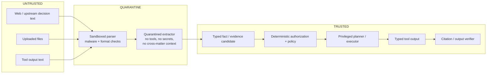

# Threat model — Bağımsız Yargı ve Mevzuat MCP / ColleX research stack

Status: v1 (engineering draft; independent security review still pending).
Last updated: **2026-08-27** — §4's mapping now cites the tests that actually
enforce each row, and §6 records what changed.

Scope: the Python FastMCP provider gateway (this repo), the TypeScript
control-plane, the Supabase/Postgres data plane, and the planned
upload/drafting pipeline. RAG, fine-tuning or system prompts do **not**
eliminate prompt injection: all source/upload text sits at the
`UNTRUSTED_DATA` boundary.

## 1. Assets

| Asset | Why it matters |
|---|---|
| Provider credentials (BRAVE_API_TOKEN, TAVILY_API_KEY, OPENROUTER_API_KEY, MISTRAL_API_KEY, MCP_API_TOKEN) | Quota theft, impersonation; one incident already occurred (see incident record) |
| Public legal corpus + provenance (snapshots, versions, chunks, hashes, offsets) | Citation integrity; tampering = fabricated law |
| Private tenant/matter corpus (uploads, embeddings, summaries, memory) | Avukat sırrı / KVKK special categories; L2/L3 data classes |
| Research run state, claims, evidence, audit log | Legal accountability trail |
| MCP tool contract (54/55 tools, immutable registry) | Clients and the planner depend on stable, server-defined schemas |
| Upstream goodwill (Bedesten, Emsal, regulator portals) | Retry storms / quota abuse can get the service blocked |
| Telemetry/logs | Must stay content-free; leak channel otherwise |

## 2. Actors

| Actor | Trust | Notes |
|---|---|---|
| Lawyer end user (via ColleX/MCP client) | Authenticated, tenant-scoped | May paste hostile documents unknowingly |
| Operator / developer | Privileged | Runs live checks, rotations, deploys |
| Upstream portals | Untrusted content, semi-trusted availability | Their text is data, never instructions |
| Search intermediaries (Brave, Tavily) | Untrusted content | Results can contain attacker-controlled pages |
| Hosted model/embedding/OCR providers | Contractual trust only | DPA/no-training/region review gates L2/L3 routing |
| External attacker | Untrusted | Via crafted documents, web content, MCP requests |
| Malicious/compromised tenant | Authenticated attacker | Drives cross-tenant and exfiltration cases |
| The LLM itself | Untrusted executor | Bounded: no URL/SQL/shell/tenant/auth-scope selection |

## 3. Trust boundaries



Text form of the pipeline (brief §12.4):

```text
untrusted file/web/tool text
-> sandboxed parser + malware/format checks
-> quarantined extractor (no tools, no secrets, no cross-matter context)
-> typed fact/evidence candidate
-> deterministic authorization/policy
-> privileged planner/executor
-> typed tool output
-> citation/output verifier
```

A regex injection filter is never the only defense; a guard model is only an
additional layer. Identity comes from a verified token, never from model text.

## 4. Abuse cases -> controls -> enforcing tests (brief §12.4)

The last column names the test that fails if the control is removed, and
whether it currently runs. `RUNS` means it is inside a suite that exited 0 on
2026-08-27 (`pytest tests evals/tests -q` → 1046 passed;
`control-plane> npx vitest run` → 972 passed / 39 files;
`scripts/db_local_check.py` → 17/17; `scripts/run_evals.py` → RESULT: PASS;
`node control-plane/scripts/demo.mjs` → 5/5).
`PHASE-GATED` means the lane it protects does not exist yet, so the row gates
that phase instead of the current surface.

The adversarial corpus is `evals/datasets/adversarial_v1.jsonl` — **12
fixtures**, each carrying the brief §12.4 row it belongs to
(`brief_threat_row`) plus `expected_behavior` and `must_not`.
`control-plane/tests/security/corpus.test.ts` asserts every fixture against
the guard that actually owns it, and for threats owned by another layer it
asserts that `control-plane/src/security/POLICY.md` documents the delegation
**and** that the delegated component exists on disk — so a fixture can never
be quietly orphaned.

| # | Threat | Control | Enforcing test | State |
|---|---|---|---|---|
| 1 | PDF containing "ignore previous instructions" | Extractor has no tools/secrets; raw content never becomes planner instructions; evidence reaches the model only inside the `UNTRUSTED_DATA` wrapper | `control-plane/tests/security/untrusted.test.ts` (delimiter-collision in every shape: exact fence, nested, split, Unicode look-alikes), `control-plane/tests/security/properties.test.ts` (property: **no input** ever yields an unescaped wrapper delimiter), fixture `adv-inject-001` | **RUNS** |
| 2 | `SYSTEM:` text inside a web page / court decision | Planner only ever sees typed evidence objects; an injection-shaped passage is **labelled, not edited** | `control-plane/tests/pipeline/console.test.ts` + `control-plane/tests/answer/pipeline.test.ts` (an injected payload does **not** change control flow: same stages, same lane count, same evidence count, and the payload appears only inside the quote block), fixture `adv-inject-002` | **RUNS** |
| 3 | Cross-tenant leak (vector, canonical text, chunk text, citation graph, cache) | RLS on `documents` **and** on `document_versions` / `chunks` / `document_relations`, resolving tenancy through the owning document (ADR-011); fail-closed when no tenant context; separate public/private lanes; scoped cache keys | `scripts/db_local_check.py` **c8** and **c9** (non-superuser probe role, tenant B's `canonical_text` + `original_text` unreadable by tenant A, public rows still readable, cross-tenant relation hidden), `tests/ingestion/test_rls_leak.py`, and the retrieval-level gate `cross_tenant_leak_indicators == 0` in `scripts/run_evals.py` (exits 1 otherwise). Fixtures `adv-tenant-001`, `adv-tenant-002` | **RUNS** for the corpus lanes; the private-upload lane and the "authorization revoked mid-session" case remain **PHASE-GATED** |
| 4 | SSRF | Host allowlist, id→URL resolver, private-IP / cloud-metadata block, scheme and userinfo and port checks in a fixed order with **specific** reason codes | `control-plane/tests/security/urlPolicy.test.ts` (every rejection asserts its reason code, so widening a class is caught), fixtures `adv-ssrf-001`, `adv-xxe-001` | **RUNS** |
| 5 | Tool-based exfiltration | The model cannot choose URL / SQL / auth scope / tenant; no external-write tool exists; `authContext` cannot come from the planner | `control-plane/tests/executor.test.ts` + `cp-fixes-executor.test.ts` (capability allowlist; planner-supplied auth rejected), `control-plane/tests/policy.test.ts`, fixture `adv-tool-001` | **RUNS** |
| 6 | MCP confused deputy | Bearer token required on the HTTP transport; no inbound token is passed downstream | `scripts/live_local_gateway_check.py` (a request without `Authorization` gets **401** from a real uvicorn worker over the real MCP transport), `scripts/http_e2e_check.py` | **RUNS** for token presence. Audience validation / resource indicators / short-lived tokens are **NOT implemented** — this fork has no OAuth; that part of the row is open |
| 7 | Tool schema manipulation | Server-side immutable tool registry; the capability registry is frozen and orphan-tested; the surface is exactly 54 offline | `control-plane/tests/registry.test.ts`, `tests/test_tool_surface.py`, `scripts/smoke_check.py`, and `tools/list` over the real transport in `live_local_gateway_check.py`; fixture `adv-tool-001` | **RUNS** |
| 8 | Citation tampering | Immutable version + `content_sha256` + code-point offsets on every citation; the verifier re-derives the quote from canonical text before it is trusted | `control-plane/tests/validator.test.ts` (`OFFSET_OUT_OF_RANGE`, `QUOTE_OFFSET_MISMATCH`, `QUOTE_HASH_MISMATCH`, `DOCUMENT_VERSION_MISMATCH`), `demo.mjs` **S5** — one character flipped → citation rejected, claim drops to unsupported, answer refuses to finalize (7/7); `run_evals.py` gate `quote_hash_integrity == 100%`; fixture `adv-cite-tamper-001` | **RUNS** |
| 8b | Fabricated citation (an id that does not exist) | Every ranked hit must resolve to a document in the corpus inventory | `run_evals.py` gate `fabricated_ids == 0` (exits 1 otherwise); `evals/tests/test_gates.py` proves the gate by flipping it to FAIL with an id outside the inventory; `evals/citations/check_citations.py`; fixtures `adv-fabricate-001/002` | **RUNS** |
| 9 | Zip / PDF / UDF attack | Quarantine, AV, size limits, sandbox, XXE disabled | Fixtures `adv-resource-001`, `adv-xxe-001` exist and `corpus.test.ts` asserts the delegation is documented in `POLICY.md`; the XXE/SSRF half is enforced today by `urlPolicy.test.ts` | **PHASE-GATED** — the upload pipeline (PLAN phase 6) does not exist |
| 10 | Log / prompt leak | Content-off telemetry, redaction, log scanning; `.env` is never read into tooling output; DSNs are never printed (only the database name) | `.gitleaks.toml` + CI `secret-scan` job over full history; `control-plane/scripts/serve.mjs` prints `dbNameOf(dsn)`, never the DSN | **PARTIAL** — no telemetry sink exists yet, so there is no log-scanning test to run |
| 11 | Unbounded agency | Round / tool / token / time / cost caps; budget exhaustion terminates as a typed `partial` and never throws; idempotent replay | `control-plane/tests/executor.test.ts`, `cp-fixes-executor.test.ts`, `control-plane/src/orchestration/budgets.ts` | **RUNS** |
| 12 | HTML / Markdown exfil in rendered output | `sanitizeMarkdown` (idempotent by property test); the console assigns **no markup** — every value goes through `textContent`; served CSP pins the page's own inline script/style by SHA-256 with `default-src 'none'`, `img-src 'none'`, `connect-src 'self'`; a link element is created only when the server approved the URL as https + allowlisted host | `control-plane/tests/security/renderGuard.test.ts` (every escape route; output must contain no `<`/`>`, no live off-allowlist target, and be stable under a second pass), `control-plane/tests/security/properties.test.ts` (idempotence as a property over the corpus + generated adversarial strings), `control-plane/tests/pipeline/console.test.ts`; fixture `adv-exfil-001` | **RUNS** |
| 13 | Supply-chain | Lockfile pinning (`uv.lock`, `control-plane/package-lock.json` via `npm ci`); no new dependency may be added to the control-plane | No automated SBOM or vulnerability gate exists | **OPEN** — this row has no enforcing test |

## 5. Security gates

- This document plus adversarial fixtures live in CI (offline).
- Zero tolerance: cross-tenant retrieval, secret exfiltration, unauthorized
  writes, fabricated citations.
- Identity from verified tokens only; revoking authorization immediately ends
  session/cache/retrieval access.
- Kill switches exist per lane: hosted model, upload, deep research, provider.
- No release with an open P0/P1 security finding.
- The MCP auth/security specification current at implementation time must be
  re-read; Resource Indicators, audience validation and the ban on passing
  inbound tokens downstream are preserved.

## 6. Current-state notes (this repo, 2026-08-27)

- HTTP transport auth: `REQUIRE_HTTP_AUTH` + `MCP_API_TOKEN` (>= 32 chars),
  `ALLOWED_ORIGINS` CORS control. No OAuth/Clerk in this fork, so row 6's
  audience-validation and resource-indicator requirements are **not met** —
  only token presence is enforced, and that is now proven against a real
  server (`scripts/live_local_gateway_check.py`, exit 0, 401 without a token).
- Credential handling is fail-closed (no embedded fallbacks), guarded by the
  gitleaks CI gate (`.gitleaks.toml`) and by
  `tests/test_disabled_modules.py` / `scripts/smoke_check.py`.
- **Open incident:** rotation of the historically embedded Brave/Tavily keys
  is still pending user action —
  `docs/security/incident-2026-08-26-embedded-tokens.md` remains **OPEN**.
- **What changed on 2026-08-27.** Adversarial review found and closed two P0
  defects in the data plane, both of which sat directly under row 3:
  - **Cross-tenant content leak.** RLS was enabled on `legal.documents` only,
    while `legal.document_versions`, `legal.chunks` and
    `legal.document_relations` were granted plain `SELECT` to `authenticated`
    with no row security. Any tenant could read another tenant's
    `canonical_text` / `original_text` — the full document text — by selecting
    from the child table directly, and the citation graph the same way. Fixed
    by resolving tenancy through the owning document (ADR-011), with the leak
    reproduced and then pinned by `db_local_check.py` c9 and
    `tests/ingestion/test_rls_leak.py`.
  - **Temporal versioning was non-functional.** `'infinity'` is a finite
    `timestamptz`, so `upper_inf()` was always false and nothing closed the
    previous version. That is an integrity defect as much as a correctness
    one: "the version in force on this date" is what an authority/currentness
    check depends on. Fixed in SQL (ADR-012), pinned by `db_local_check.py`
    c10/c11 and `tests/ingestion/test_versioning.py`.
- **The operator console is a new attack surface** and is treated as one: it
  binds `127.0.0.1` only, has **no authentication**, assigns no markup, and
  serves a CSP that pins its own inline script and style by SHA-256. It must
  not be exposed (RISKS #13).
- Rows 9 and the private-upload half of row 3 apply to the not-yet-built
  upload/private-corpus lanes; they gate those phases (PLAN phases 6–8), not
  the current surface. Row 13 has no enforcing test at all today.
- Nothing in this repository has ever contacted a live Supabase project, and
  no Supabase or Resend MCP tool has been used at any point. All data-plane
  verification is against a local scratch PostgreSQL.
